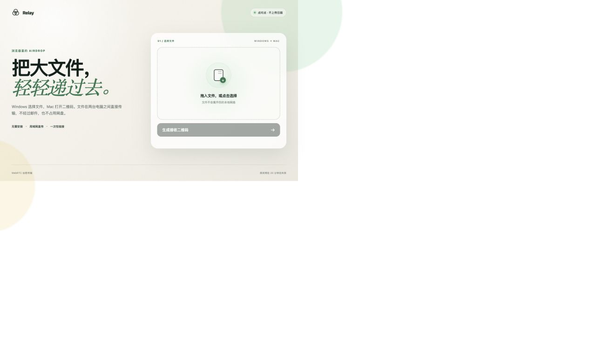

# Relay

**Cross-device AirDrop without an install or a file upload.**

[简体中文](README.md) · [Live demo](https://relay.xueai.pro) · [Security](SECURITY.md)

[](https://vercel.com/new/clone?repository-url=https%3A%2F%2Fgithub.com%2Fsemimail-source%2Frelay-file-transfer)



Relay is an open-source, browser-only file transfer tool for Windows, macOS,
iPhone, iPad, and Android. Select one or more files and share a one-time link,
QR code, or short pickup code. The files move in real time over WebRTC and are
never stored by Relay.

## Highlights

- No app or account required.
- End-to-end AES-GCM encryption for file contents and file names.
- Peer-to-peer WebRTC DataChannel transfer with optional TURN fallback.
- One-time links, locally generated QR codes, and human-friendly pickup codes.
- Multiple files with per-file size, chunk-count, and SHA-256 verification.
- Optional six-digit human confirmation before connecting.
- Built-in TURN enable switch, administrator approval, and monthly usage limit.

## How it works

1. The sender opens the [live demo](https://relay.xueai.pro), selects files, and
   enters a 4–6 letter name.
2. Relay creates a link, QR code, and a pickup code such as `EMMA-482731`.
3. The receiver opens the link or enters the code at
   [`/pickup`](https://relay.xueai.pro/pickup).
4. Both browsers remain online while the receiver accepts and saves the files.

A pickup code is case-insensitive, can be entered without the hyphen, and
expires immediately after its first claim. Rooms expire after two hours. Relay
does not store files for later download, so it is intentionally different from
OneDrive or WeTransfer.

## Security model

- A browser-generated 256-bit key encrypts file names and contents with AES-GCM.
- The key lives only in the URL fragment and is not sent in HTTP requests.
- Pickup codes are not encryption keys. The server receives only a
  domain-separated SHA-256 digest and invalidates it on first claim.
- The signaling service stores short-lived pairing state, token hashes, and
  WebRTC signaling—not the files.
- WebRTC adds DTLS transport encryption; application-layer encryption keeps
  file data private even from a TURN relay.

See [SECURITY.md](SECURITY.md) for boundaries and vulnerability reporting.

## Run locally

Node.js 18 or newer is required.

```bash
git clone https://github.com/semimail-source/relay-file-transfer.git
cd relay-file-transfer
npm install
npm run build
npm test
npm start
```

Open `http://localhost:8788`. Cross-device browser cryptography generally
requires an HTTPS deployment rather than a private plain-HTTP address.

## Deploy

Use the **Deploy with Vercel** button above or import the repository into
Vercel. Copy the required names from `.env.example` into the deployment
environment. Never commit `.env.local`.

| Variable | Purpose | Required |
| --- | --- | --- |
| `KV_REST_API_URL`, `KV_REST_API_TOKEN` | Shared Upstash Redis REST signaling store | On Vercel |
| `TURN_KEY_ID`, `TURN_KEY_API_TOKEN` | Cloudflare Realtime TURN | Reliable cross-network transfer |
| `CLOUDFLARE_ACCOUNT_ID`, `CLOUDFLARE_ANALYTICS_API_TOKEN` | TURN egress usage query | Usage protection |
| `RELAY_ADMIN_TOKEN` | `/admin` relay control | TURN control |
| `TURN_ENABLED=1` | Server-side TURN master switch | TURN control |
| `TURN_MONTHLY_LIMIT_GB` | Credential cutoff; defaults to `800` | Optional |
| `PUBLIC_ORIGIN` | Canonical public URL | Optional |

Keep `TURN_ENABLED=0` until every credential is configured. Then set it to `1`
and manually enable relay access from `/admin`.

## Cost protection

TURN is available only when the environment switch is enabled, an administrator
has allowed it, and measured monthly usage is below the configured limit. Relay
fails closed when usage monitoring is missing or unavailable. Usage analytics
may be delayed, so the threshold is a safety buffer rather than a byte-exact
billing cap.

## Contributing

Issues and pull requests are welcome. Read [CONTRIBUTING.md](CONTRIBUTING.md)
before submitting a change.

MIT License
