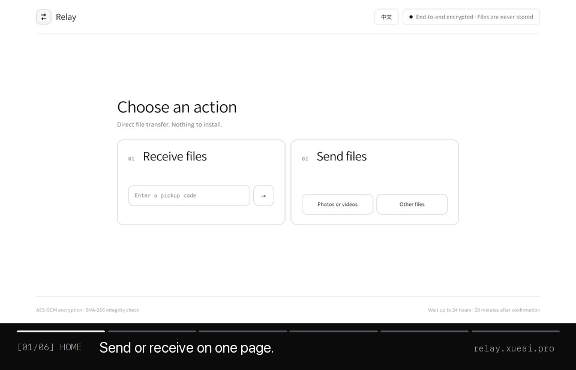

# Relay

**无需安装、文件不上传服务器的跨设备 AirDrop。**

[English](README.en.md) · [在线体验](https://relay.xueai.pro) · [安全说明](SECURITY.md)

[](https://vercel.com/new/clone?repository-url=https%3A%2F%2Fgithub.com%2Fsemimail-source%2Frelay-file-transfer)



Relay 是一个开源的浏览器文件直传工具。Windows、macOS、iPhone、iPad 和 Android 无需安装客户端：选择一个或多个文件，把网址、二维码或简短取件码告诉对方，即可实时传输。

## 为什么用 Relay

- **不安装软件**：现代浏览器打开即用。
- **不上传文件**：文件通过 WebRTC DataChannel 在两台设备之间实时传输；无法直连时可使用 TURN 中继，但中继看不到明文。
- **端到端加密**：文件和文件名使用浏览器生成的 256 位密钥进行 AES-GCM 加密。
- **容易告诉对方**：支持一次性网址、二维码，以及 `EMMA-482731` 形式的取件码；不区分大小写，短横线可省略。
- **多个文件**：一次选择或拖入多个文件，逐个验证完整性并保存。
- **多个发送任务**：在同一个首页新增、切换和关闭最多 6 个独立任务，切换时不会中断正在等待或传输的任务。
- **跨网络可用**：配置 TURN 后，即使双方不在同一 Wi-Fi，也能建立连接。
- **可控制费用**：内置 TURN 总开关、管理员许可和月流量安全线。

## 使用方法

1. 发送方打开 [relay.xueai.pro](https://relay.xueai.pro)，选择文件并输入 4–6 位英文字母名字。
2. 把生成的网址、二维码或“名字 + 6 位数字”取件码告诉接收方。
3. 接收方打开链接，或进入 [`/pickup`](https://relay.xueai.pro/pickup) 输入取件码。
4. 接收方点击“我已收到”后开始 20 分钟倒计时；双方保持网页在线，接收方点击接收并保存文件。

取件码领取一次后立即失效。接收方确认前最长等待 24 小时，确认后接收窗口为 20 分钟。发送方可选开启额外六位验证码确认。Relay 不会离线保存文件，因此它不是 OneDrive 或 WeTransfer 的替代品。

## 安全设计

- 解密密钥只放在网址的 `#fragment`，不会随 HTTP 请求发送给服务器；二维码在浏览器本地生成。
- 取件码不是文件密钥。服务器只接收带域隔离的 SHA-256 摘要，并在首次领取后使其失效。
- 信令服务器只保存令牌哈希、短期配对状态和 WebRTC 信令，不接触文件内容。
- 文件经过 AES-GCM 加密后分块传输；接收端同时核对大小、块数和 SHA-256。
- WebRTC 本身使用 DTLS 加密；应用层加密使 TURN 中继也无法读取文件或文件名。
- 可执行和安装类文件会显示额外风险提醒，文件不会被自动打开。

完整的威胁边界和报告方式见 [SECURITY.md](SECURITY.md)。

## 本地运行

需要 Node.js 18 或更高版本。

```bash
git clone https://github.com/semimail-source/relay-file-transfer.git
cd relay-file-transfer
npm install
npm run build
npm test
npm start
```

打开 `http://localhost:8788`。本机地址可以使用 Web Crypto；跨设备访问普通 HTTP 地址通常不行，因此跨设备测试应使用 HTTPS 部署。

## 部署到公网

点击上方 **Deploy with Vercel**，或把仓库导入 Vercel。复制 `.env.example` 中需要的变量到部署平台，不要上传 `.env.local`。

核心配置：

| 变量 | 用途 | 是否必需 |
| --- | --- | --- |
| `KV_REST_API_URL`、`KV_REST_API_TOKEN` | Upstash Redis REST，多实例共享短期信令 | Vercel 必需 |
| `TURN_KEY_ID`、`TURN_KEY_API_TOKEN` | Cloudflare Realtime TURN | 跨网络可靠传输需要 |
| `CLOUDFLARE_ACCOUNT_ID`、`CLOUDFLARE_ANALYTICS_API_TOKEN` | 查询 TURN 当月出口流量 | 启用费用保护需要 |
| `RELAY_ADMIN_TOKEN` | 登录 `/admin` 中继控制台 | 启用 TURN 需要 |
| `TURN_ENABLED=1` | 服务端 TURN 总开关 | 启用 TURN 需要 |
| `TURN_MONTHLY_LIMIT_GB` | 自动停止签发凭证的安全线，默认 `800` | 可选 |
| `PUBLIC_ORIGIN` | 固定公开域名 | 可选 |
| `ROOM_TTL_MS` | 接收方确认前的最长等待时间，默认 24 小时 | 可选 |
| `CONFIRMED_ROOM_TTL_MS` | 接收方确认后的传输窗口，默认 20 分钟 | 可选 |

部署后先保持 `TURN_ENABLED=0`。确认 Redis、Cloudflare 和管理员口令均已配置，再改为 `1`，并在 `/admin` 手动允许中继。

## 中继费用保护

中继只有在 `TURN_ENABLED=1`、管理员手动允许、当月用量低于安全线三个条件同时满足时才启用。达到默认 800GB 后会停止签发新凭证并关闭手动许可；监控未配置、查询失败或返回异常时也会故障安全关闭。

Cloudflare Analytics 可能存在统计延迟，因此安全线不是精确到字节的账单硬封顶。公开部署者应根据自己的套餐降低阈值，并设置服务商账单提醒。

## 技术栈

原生 HTML/CSS/JavaScript · WebRTC DataChannel · Web Crypto · Node.js · Upstash Redis REST · Cloudflare Realtime TURN · Vercel

## 参与贡献

欢迎提交 Issue 和 Pull Request。开始前请阅读 [CONTRIBUTING.md](CONTRIBUTING.md)。

MIT License
